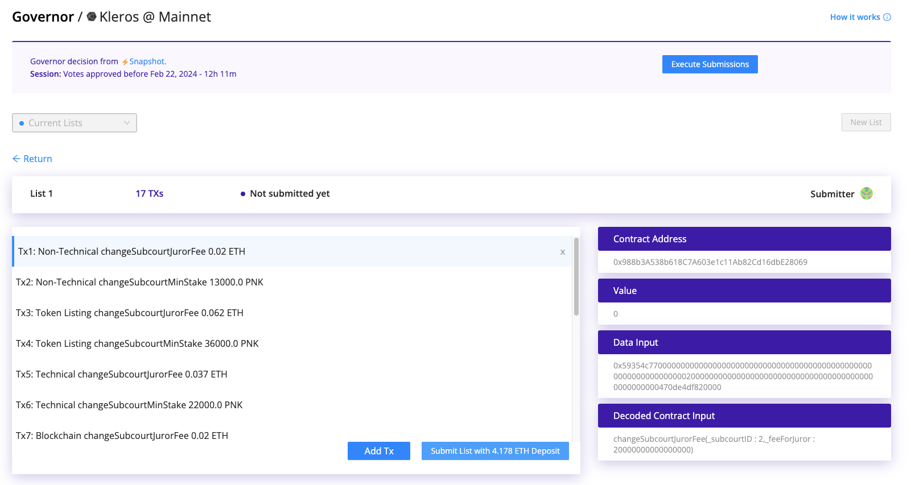
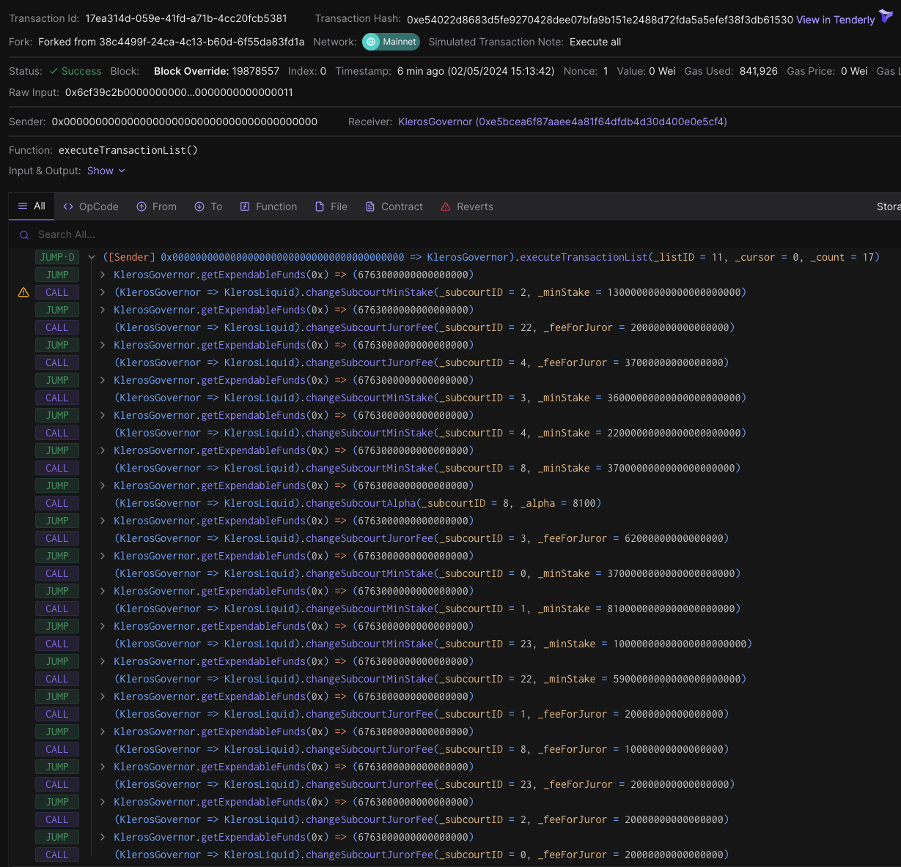
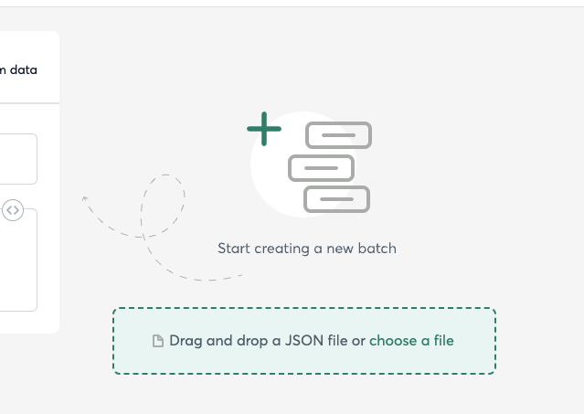
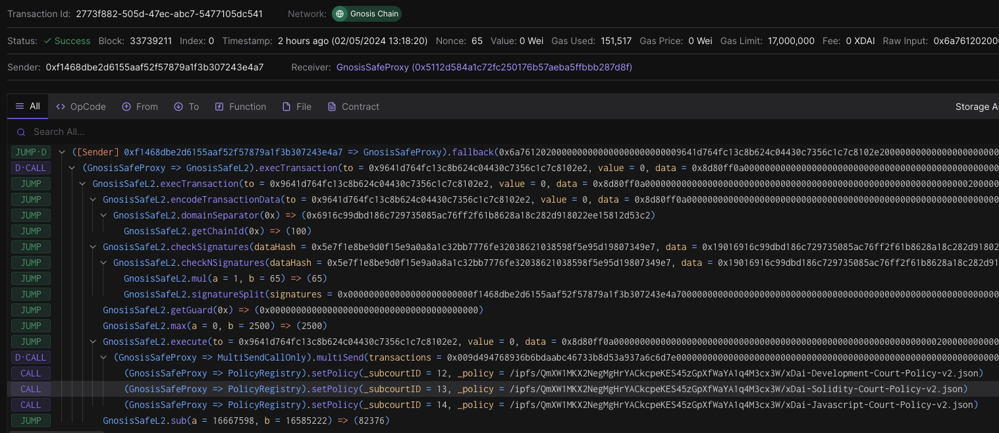
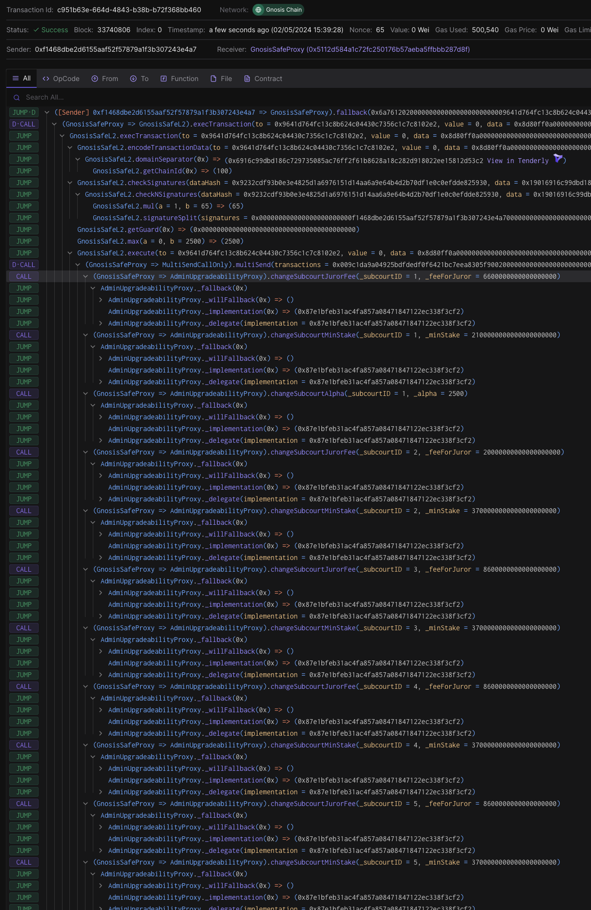

## Ethereum Governor

### [KIP-69 Court Parameters](https://forum.kleros.io/t/kip-69-parameter-updates-april-2024/1086) 

#### Transaction List

[./transaction-batch-klerosliquid-kip69.json](./transaction-batch-klerosliquid-kip69.json)

#### Produced by 

[./tx-builder-klerosliquid.sh](./tx-builder-klerosliquid.sh)

#### Simulations

- [governor.submitList()](https://dashboard.tenderly.co/explorer/fork/f2b3c66a-0bd5-46be-9635-6249e0cc42dc/simulation/c0443b35-841f-4ba5-9868-32ec3edcb16e) with 4.44 ETH
- [governor.executeTransactionList()](https://dashboard.tenderly.co/explorer/fork/f2b3c66a-0bd5-46be-9635-6249e0cc42dc/simulation/17ea314d-059e-41fd-a71b-4cc20fcb5381)

---

## Gnosis chain Multisig

The transactions must be submitted to the Safe app for the Governor multisig 0x5112d584a1c72fc250176b57aeba5ffbbb287d8f using the transaction builder:
https://app.safe.global/apps/open?safe=gno:0x5112d584a1c72fc250176b57aeba5ffbbb287d8f&appUrl=https%3A%2F%2Fapps-portal.safe.global%2Ftx-builder

### [KIP-70 Development Policy Update](https://forum.kleros.io/t/proposal-to-amend-the-description-of-the-xdai-development-courts/1085) 

Target: [Policy Registry 0x9d494768936b6bDaabc46733b8D53A937A6c6D7e](https://gnosisscan.io/address/0x9d494768936b6bDaabc46733b8D53A937A6c6D7e#code)

#### Transaction Batch
[./transaction-batch-policies-kip70.json](transaction-batch-policies-kip70.json)

#### Produced by
[./tx-builder-policyregistry.sh](./tx-builder-policyregistry.sh)

#### Simulation

https://dashboard.tenderly.co/public/safe/safe-apps/simulator/2773f882-505d-47ec-abc7-5477105dc541

### [KIP-69](https://forum.kleros.io/t/kip-69-parameter-updates-april-2024/1086) + [KIP-70](https://forum.kleros.io/t/proposal-to-amend-the-description-of-the-xdai-development-courts/1085) Court Parameters

Target: [xKlerosLiquid Proxy 0x9C1dA9A04925bDfDedf0f6421bC7EEa8305F9002](https://gnosisscan.io/address/0x9C1dA9A04925bDfDedf0f6421bC7EEa8305F9002#code)

#### Transaction Batch

[./transaction-batch-xklerosliquid-kip69.json](./transaction-batch-xklerosliquid-kip69.json)

#### Produced by
[./tx-builder-xklerosliquid.sh](./tx-builder-xklerosliquid.sh)

#### Simulation
https://dashboard.tenderly.co/public/safe/safe-apps/simulator/c951b63e-664d-4843-b38b-b72f368bb460

